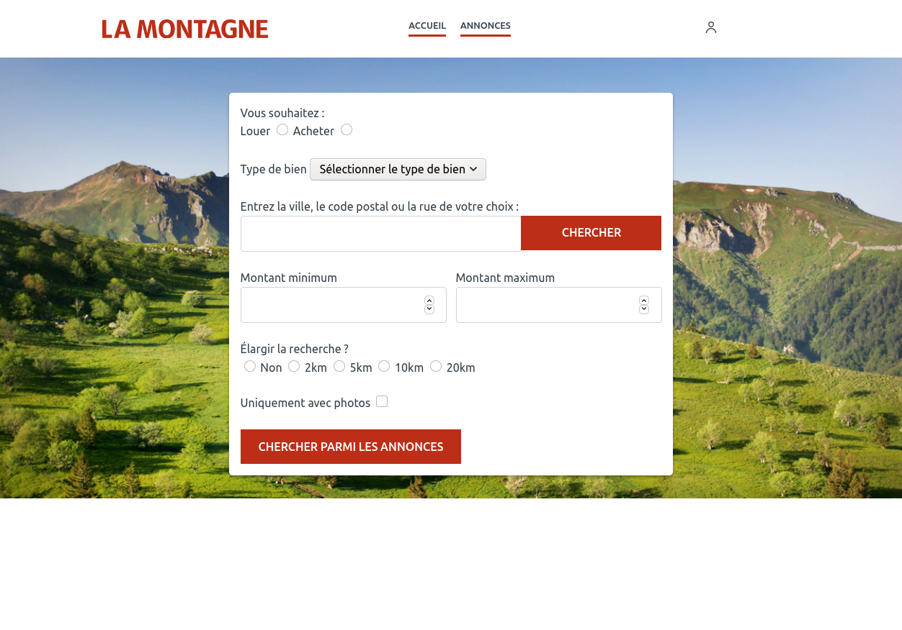
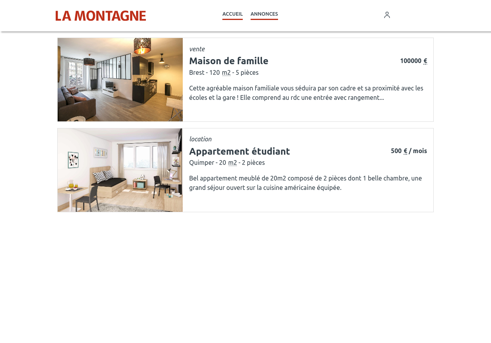
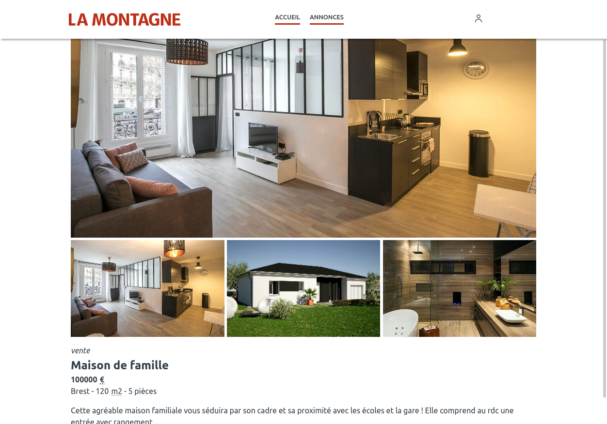

# La montagne NuxtJS Training

An exercise to learn Nuxt and re-train on VueJS. Done in two days to refresh myself for a job interview. Code is probably ugly and non optimized.

## How to see

This project is using [Json Server](https://github.com/typicode/json-server) for the local dev API, thus only work locally.

### Requirements

- NodeJS
- Yarn

### Install

- git clone
- cd la-montagne
- yarn
- yarn dev

Images are treated with the `images.sh` bash script.

## Screens

The search is the more complex component due to error handling. Errors are detected per input and should respect RGAA standards.

Listing is simple but present some accessibility details, like the use of `<abbr>` for *Euro*, *M2* and */* when used in *amount / month*.

The announce page has a simple image selection, not very optimised.
